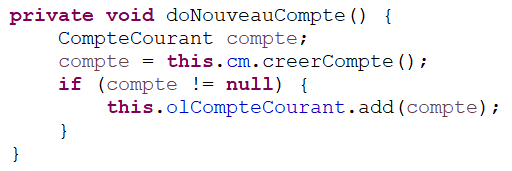
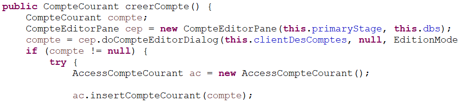

= Daily Bank App - Documentation technique V1

Nom:: Documentation technique V1

Date::
08/05/2022

Nom du client:: Daily Bank

Equipe::
Mazeau Antoine <antoine.mazeau31@gmail.com> +
Benachir Alexandre <> +
Recher Olivier <recher.olivier@outlook.fr> +
Martinet Leila <leila.mrtnt1@gmail.com> +

Sommaire::
<<I. Presentation>> +
<<II. Architecture>> +
<<III. Analyse existant>> +
<<IV. Fonctionnalite>> +

'''

== Bienvenue sur Daily Bank App

[id = "I. Presentation"]
=== I. Présentation de l'application

L'application finale doit permettre de gérer les comptes bancaires des clients d'une banque. La banque Daily Bank, notre client, possède déjà une application mobile, _Daily Bank_. Or, celle-ci est assez limitée en terme de fonctionnalités et ne répond pas aux nouveaux besoins de la banque. +
Les utilisateurs de l'application sont les guichetiers et les chefs d'agence. Les premiers pourront effectuer les opérations courantes, tandis que les seconds auront en plus les opérations exceptionnelles.

[id = "II. Architecture"]
=== II. Architecture

L'application _Daily Bank_ est codée en Java 8 et est encodé en UTF-8. Elle est connectée à une base de données relationnel SQL. Dans cette base de données, toute les informations de la banque y sont stocker. Voici les informations stocké sur les clients et les employés : +
- Client : numéro identifiant, nom, prénom, adresse mail, id de l'agence, adresse postale, numéro de téléphone et s'il est inactif ou non +
- Employé : numéro identifiant, nom, prénom, droits d'accès (Chef d'agence ou guichetier), login et mot de passe leur permettant de ce connecter à l'application. + 
Pour ce connecter à la base de données, nous utilisons la classe "LogToDatabase.java". Le rôle de la base de données est donc de stocker toute les données relatives au bon fonctionnement de l'application. Les données de la base sont stocker sur un serveur que l'IUT héberge. +
L'application java a pour rôle de proposer un affichage compréhensible, facile d'utilisation et sans bug de la banque. Pour pouvoir y accéder, l'utilisateur doit se logger à la base de données via l'interface de l'application. L'IHM de l'application est en JavaFX.

Pour la version 1 de la banque, nous n'avons pas eu à utiliser de resources externers. +

L'application est structuré en paquet que l'on nomme "package". Elle contient 2 package principaux (_application_ et _model_). Ces deux package sont découpé en sous-package (3 sous-package pour _application_ et 2 pour _model_). Les packages sont structuré de cette maniere : +
- application : application.control, application.tools, application.view +
- model : model.data, model.orm, model.orm.exceptioon +
Le fonctionnement de l'application se base sur un principe simple qui permet d'avoir des fenêtre modela, c'est-à-dire que la dernière fenêtre ouverte bloquera l'utilisation des autres fenêtre ouvertes. +
Pour résumer, les classes de package _application.vew_ vont permettre de charger les scènes FXML réalisé avec SceneBuilder. Lorsque l'utilisateur clique sur bouton qui fait appel à une fonction, le controleur (dans le package _application.vew_) fait appel à la fonction de la classe adéquate dans le package _application.control_. Les classes du package application.control vont ce charger d'appeller les fonction du package model.orm qui vont récupérer/modifier les données directemment sur la BD. Le package _model.orm_ va s'assurer d'enregistrer définitivemment les modifications sur la bases de données. 

[id = "III. Analyse existant"]
=== III. Analyse existant

.La V0 de Daily Bank comprend déjà les fonctionnalités suivantes :
* Pour le guichetier :
** Modifier informations client (adresse, téléphone, …)
** Créer un nouveau client
** Consulter un compte
** Débiter un compte
* Pour le chef d'agence :
** Rendre inactif un client 

image::uc_V0.png[title="Use case v0 (uniquement) // réalisé avec PlantUml"]

[id = "IV. Fonctionnalite"]
=== IV. Fonctionnalite

* Pour le guichetier :
** Créer un compte bancaire (Olivier)::

Le guichetier peut créer un nouveau compte à un client existant par le biais d'une interface graphique de discussion entre l'employé et la base de donnée. L'ouverture de cet fenêtre ce fait par l'activation du bouton "nouveau compte". 

image::images/bout_nouv_compte.png[title="Bouton de création d'un nouveau compte"]

Ce bouton va déclencher la méthode doNouveauCompte :

et c'est par l'appel de la méthode creerCompte provennant de la class CompteManagement, que la fenêtre s'ouvre.

** Créditer un compte bancaire (Alexandre)
** Effectuer un virement de compte à compte (Leila)
** Cloturer un compte (Alexandre)
* Pour le chef d'agence :
** Gérer les employés (Antoine)

