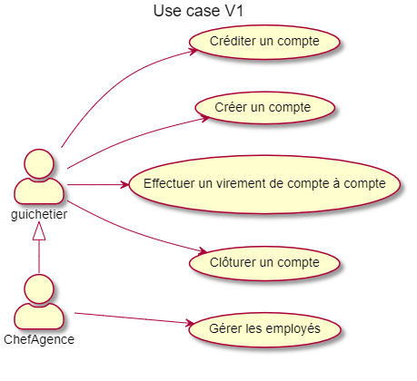

= Daily Bank App - documentation technique V0

Nom:: documentation technique V0

Date::
08/05/2022

Nom du client:: Daily Bank

Equipe::
Mazeau Antoine <antoine.mazeau31@gmail.com> +
Benachir Alexandre <> +
Recher Olivier <recher.olivier@outlook.fr> +
Martinet Leila <leila.mrtnt1@gmail.com> +

Sommaire::
<<I. Presentation>> +
<<II. Architecture>> +
<<III. Analyse existant>> +
<<IV. Fonctionnalite>> +

'''

== Bienvenue sur Daily Bank App

[id = "I. Presentation"]
=== I. Présentation de l'application

L'application finale doit permettre de gérer les comptes bancaires des clients d'une banque. La banque Daily Bank, notre client, possède déjà une application mobile, _Daily Bank_. Or, celle-ci est assez limitée en terme de fonctionnalités et ne répond pas aux nouveaux besoins de la banque. +
Les utilisateurs de l'application sont les guichetiers et les chefs d'agence. Les premiers pourront effectuer les opérations courantes, tandis que les seconds auront en plus les opérations exceptionnelles.

[id = "II. Architecture"]
=== II. Architecture

[id = "III. Analyse existant"]
=== III. Analyse existant

* Use Case +

* Diagramme de classes 

[id = "IV. Fonctionnalite"]
=== IV. Fonctionnalite

