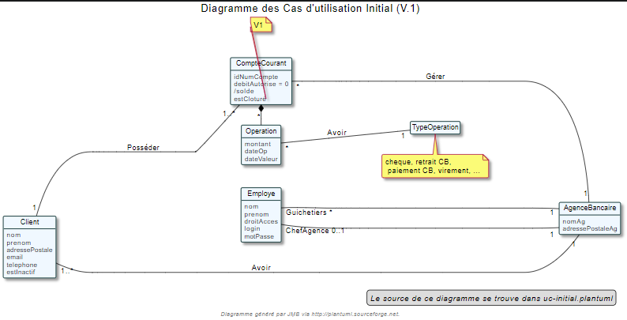
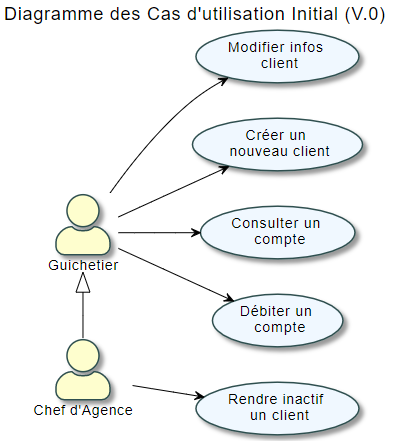
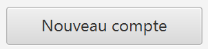
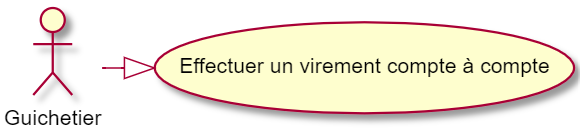
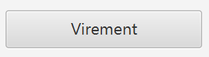
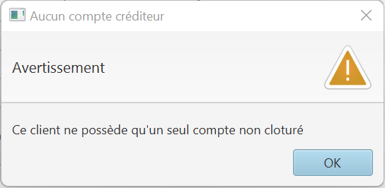
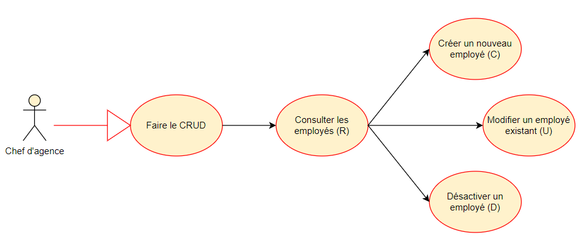
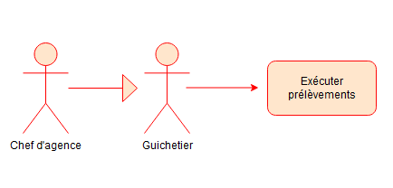
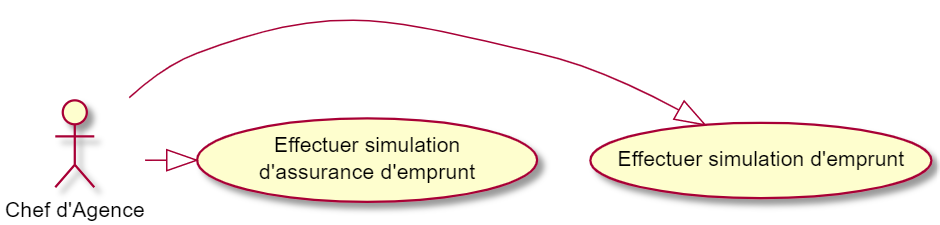

= Daily Bank App - Documentation technique V2

Nom:: Documentation technique V2

Date::
08/05/2022

Nom du client:: Daily Bank

Equipe::
Mazeau Antoine <antoine.mazeau31@gmail.com> +
Benachir Alexandre <alexandre.projetair@gmail.com> +
Recher Olivier <recher.olivier@outlook.fr> +
Martinet Leila <leila.mrtnt1@gmail.com> +

Sommaire::
<<I. Presentation>> +
<<II. Architecture>> +
<<III. Analyse existant>> +
<<IV. Fonctionnalites V1>> +
<<V. Fonctionnalites V2>> +

'''

== Bienvenue sur Daily Bank App

[id = "I. Presentation"]
=== I. Présentation de l'application

L'application finale doit permettre de gérer les comptes bancaires des clients d'une banque. La banque Daily Bank, notre client, possède déjà une application mobile, _Daily Bank_. Or, celle-ci est assez limitée en terme de fonctionnalités et ne répond pas aux nouveaux besoins de la banque. +
Les utilisateurs de l'application sont les guichetiers et les chefs d'agence. Les premiers pourront effectuer les opérations courantes, tandis que les seconds auront en plus les opérations exceptionnelles. +

Afin de mieux comprendre le fonctionnement de Daily Bank App, voici ci-dessous le diagramme de classe du programme comprennant les différents acteurs qui interviennent dans l'application.

Nous retrouvons::

* Le client qui posséde un ou plusieurs compte courant et qui est dans une agence bancaire.
* Les comptes courants sont possédés par un client et ils sont gérer par l'agence bancaire dont ils dépendent.
* Les comptes courants sont composés d'opérations.
* Les opérations ont un certain type d'opération.
* L'agence bancaire a des clients et gére les comptes des clients. Elle possède également des employés (guichetier et chef d'agence).
* Les employés font parti de l'agence bancaire, ils se répartissent en tant que guichetier et chef d'agence.

[id = "II. Architecture"]
=== II. Architecture

L'application _Daily Bank_ est codée en Java 8 et est encodé en UTF-8. Elle est connectée à une base de données relationnel SQL. Dans cette base de données, toute les informations de la banque y sont stocker. Voici les informations stocké sur les clients et les employés : +
- Client : numéro identifiant, nom, prénom, adresse mail, id de l'agence, adresse postale, numéro de téléphone et s'il est inactif ou non +
- Employé : numéro identifiant, nom, prénom, droits d'accès (Chef d'agence ou guichetier), login et mot de passe leur permettant de ce connecter à l'application. + 
Pour ce connecter à la base de données, nous utilisons la classe "LogToDatabase.java". Le rôle de la base de données est donc de stocker toute les données relatives au bon fonctionnement de l'application. Les données de la base sont stocker sur un serveur que l'IUT héberge. +
L'application java a pour rôle de proposer un affichage compréhensible, facile d'utilisation et sans bug de la banque. Pour pouvoir y accéder, l'utilisateur doit se logger à la base de données via l'interface de l'application. L'IHM de l'application est en JavaFX.

Pour la version 1 de la banque, nous n'avons pas eu à utiliser de resources externes. Cependant,pour la version 2 de l'application de la banque, nous avons utilisé un fichier jar externe qui est itextpdf-5.4.0 qui permet de créer des documents pdf en JAVA. +

L'application est structuré en paquet que l'on nomme "package". Elle contient 2 package principaux (_application_ et _model_). Ces deux package sont découpé en sous-package (3 sous-package pour _application_ et 2 pour _model_). Les packages sont structuré de cette maniere : +
- application : application.control, application.tools, application.view +
- model : model.data, model.orm, model.orm.exceptioon +
Le fonctionnement de l'application se base sur un principe simple qui permet d'avoir des fenêtre modela, c'est-à-dire que la dernière fenêtre ouverte bloquera l'utilisation des autres fenêtre ouvertes. +
Pour résumer, les classes de package _application.vew_ vont permettre de charger les scènes FXML réalisé avec SceneBuilder. Lorsque l'utilisateur clique sur bouton qui fait appel à une fonction, le controleur (dans le package _application.vew_) fait appel à la fonction de la classe adéquate dans le package _application.control_. Les classes du package application.control vont ce charger d'appeller les fonction du package model.orm qui vont récupérer/modifier les données directemment sur la BD. Le package _model.orm_ va s'assurer d'enregistrer définitivemment les modifications sur la bases de données. 

[id = "III. Analyse existant"]
=== III. Analyse existant

.La V0 de Daily Bank comprend déjà les fonctionnalités suivantes :
* Pour le guichetier :
** Modifier informations client (adresse, téléphone, …)
** Créer un nouveau client
** Consulter un compte
** Débiter un compte
* Pour le chef d'agence :
** Rendre inactif un client 

[id = "IV. Fonctionnalites V1"]
=== IV. Fonctionnalites V1

==== Pour le guichetier :

=====  1. Créer un compte bancaire (Olivier) - V1

Le guichetier peut créer un nouveau compte à un client existant par le biais d'une interface graphique de discussion entre l'employé et la base de donnée. L'ouverture de cet fenêtre ce fait par l'activation du bouton "nouveau compte". 

 

Ce bouton va déclencher la méthode doNouveauCompte dans la class ComptesManagementController. 
Cette méthode va appeler la fonction creerCompte provenant de la class CompteManagement, c'est cette dernière qui va s'occuper de l'ouverture de la fenêtre et qui va créer le compte du client en retournant ce compte à la class ComptesManagementController afin qu'elle puisse l'ajouter dans sa liste "ObservableList<CompteCourant>" permettant le bon affichage de tout les comptes du client.

Pour la création du compte, la méthode creerCompte appelle le constructeur de la class CompteEditorPane, c'est cette dernière qui va s'occuper du chargement du fichier fxml "compteeditorpane.fxml" et ainsi ouvrir la fenêtre de dialogue avec l'utilisateur.

Dans CompteManagement, c'est par l'appel de la fonction "doCompteEditorDialog()" que le programme va récupérer tous les informations fournies par l'utilisateur dans la boîte de dialogue. Le compte sera créé, puis, s'il n'est pas nul, le programme appellera la méthode "insertCompteCourant(compte)" provenant de la class AccessCompteCourant afin de stocker les informations du nouveau compte dans la base de donnée.

C'est dans cette méthode que le compte du client va être ajouté à la base donnée sur oracle par une requête SQL reprenant les différents attributs du CompteCourant passé en paramètre.

===== 2. Créditer un compte bancaire (Alexandre) - V1

Le guichetier peut se rendre sur le compte bancaire d'un client et effectuer un crédit.
En appuyant sur le bouton "Enregistrer Crédit", on déclenche la méthode _doCrédit() _ de la classe _OperationsManagementController_, qui va elle-même appeler la fonction _enregistrerCrédit ()_ qui gère l'enregistrement des crédits de la classe _OperationsManagement_. Celle-ci va appeler la fonction _doOperationEditorDialog(CompteCourant cpte, CategorieOperation cm)_ avec comme catégorie d'opérations _CREDIT_ de la classe _OperationEditorPane_ pour l'affichage de la fenêtre. Celle-ci fait appelle à la méthode _displayDialog(CompteCourant cpte, CategorieOperation mode)_ qui va configurer l'interface en fonction de la catégorie d'opération. A la fin de celle-ci, on affiche l'interface bien configuré on attend que l'utilisateur ajoute le montant et que la méthode retourne une opération.
Pour créditer un compte, on peut choisir un moyen de paiement (Dépôt Espèces/Dépôt Chèque) et rentrer le montant dans un champ. Pour valider le crédit, vous pouvez appuyer sur le bouton "Effectuer Crédit" qui déclenchera la méthode _doAjouter()_ qui vérifiera en premier temps si la saisie du champ montant est bien valide et le cas contraire encadrera le champ en rouge et affichera l'erreur en haut de la page. Les cas d'erreurs sont si le champ est vide, si le champ ne contient pas un nombre ou s'il est inférieur ou égale à 0.
Si les conditions sont respectés, on récupére le mode de paiement et on crée une opération qu'on va ensuite retourner. Nous revenons donc la méthode _doOperationEditorDialog(CompteCourant cpte, CategorieOperation cm)_ qui retourne elle aussi l'opération. Et nous voila donc dans la méthode _enregistrerCredit()_ avce la bonne opération. Ensuite nous créeons une variable AccessOperation qui nous permettra d'insérer dans la base de donnée l'opération. Nous utilisons la méthode _insertDebit(int idNumCompte, double montant, String typeOp)_ qui fera appel à la procédure stockée "Debiter" avec les bonnes informations. Dans la procédure est vérifier si l'opération est un crédit ou un débit grâce au mode de paiement. Pour finir on actualise la liste des opérations.

===== 3. Effectuer un virement de compte à compte (Leila) - V1

Cette fonctionnalité permet aux guichetiers d'effecuter des virements de compte à compte (c'est-à-dire entre les comptes d'un même client). +

Pour effectuer un virement compte à compte, le guichetier doit se rendre, via l'interface graphique, dans la fenêtre de gestion des opérations. Là, il doit cliquer sur le bouton "Virement". +

L'appui sur ce bouton va déclencher la méthode _doVirement ()_ de la classe _OperationsManagementController_, qui va elle-même appeler la fonction _enregistrerVirement ()_ qui gère l'enregistrement des virements de la classe _OperationsManagement_. Celle-ci va appeler la fonction _doOperationEditorDialog(CompteCourant cpte, CategorieOperation cm)_ de la classe _OperationEditorPane_ pour l'affichage de la fenêtre. +
Si le client n'a pas d'autre compte actif que celui choisi pour le virement, une erreur est lancée par la fonction _displayDialog(CompteCourant cpte, CategorieOperation mode)_ de la classe _OperationEditorPaneController_. Un message d'erreur est affiché. +

Sinon, cette même méthode génère l'affichage de l'operation editor pane. +
Lors de l'appui sur le bouton "Effectuer virement", la méthode _doAjouter()_, qui permet d'ajouter l'Opération, de la classe _OperationEditorPaneController_ est appelée. Si le montant saisi n'est pas un chiffre ou n'est pas acceptable (découvert dépassé), le virement n'est pas validé. +
Si le virement est accepté, la fenêtre operation editor pane est fermée et l'Opération stockée en tant qu'attribut de _OperationEditorPaneController_. +
Le virement est alors effectué par la méthode _insertVirement(int idNumCompteDeb, int idNumCompteCred, double montantOp)_ de la classe _AccessOperation_, elle-même appelée dans la fonction enregistrerVirement (). L'Opération est alors enregistrée dans la base de données grâce à l'appel de la procédure stockée "Virer".

===== 4. Cloturer un compte (Alexandre) - V1

Vous pouvez cloturer un compte d'un client en le sélectionnant et en cliquant sur "Supprimer Compte". Cela déclenchera la méthode _doSupprimerCompte()_ qui prendra le compte sélectionné et vérifiera si le solde du compte est à 0. Le cas contraire si le solde est supérieur à 0, on affiche une alerte disant à l'utilisateur que le solde doit être à 0 avant de le cloturer sinon on fait pareil mais en disant que le solde est négatif.
Si le solde est bien à 0, on demande confirmation à l'utilisateur pour la suppression du compte. S'il accepte on crée une variable de type AccessCompteCourant et on utilise la méthode _cloturerCompteCourant(CompteCourant cc)_ avec en paramètre le compte sélectionné. Cette méthode se connecte à la base de donnée et met à jour l'attribut "estCloture" à "O". Le programme lance une exception et rollback si jamais plusieurs lignes sont mises à jour au lieu d'une seule, sinon commit.On va ensuite actualiser la liste de compte avec la méthode _loadList()_ qui fera appel à la BD pour mettre tou les comptes dans la BD.
Ensuite, pour empêcher les actions sur les comptes clôturés on utilise la méthode _validateComponentState()_ qui active/désactive certains boutons selon l'état du compte. Si un compte est cloturé, il ne peut pas utiliser les boutons "Supprimer Compte", "Modifier Compte" et "Voir Opérations".

==== Pour le chef d'agence :
===== 1. Gérer les employés (Antoine) - V1

Un chef d'agence peut faire le CRUD (Create Read Update Delete) des employés. +

Localisation des classes utilisées:: 
_DailyBankMainFrameController_ => package application.view +
_DailyBankMainFrame_ => package application.control +
_EmployeManagement_ => package application.control +
_EmployesManagementController_  => package application.view +
_AccessEmploye_ => package model.orm +
_Employe_ => package model.data +
_EmployeEditorPaneController_ => package application.view +

* _(Read)_ +
Pour acceder à la fenêtre de gestion des employés il doit allez dans le menu, cliquer sur "Gestion" puis "Employé"+ 
Ce bouton lance la fonction _doEmployeOption()_ de la classe _DailyBankMainFrameController_. +
Cette fonction va lancer une nouvelle fonction _gestionEmployes()_ de la classe _DailyBankMainFrame_ . Elle va créer un objet _EmployeManagement_ et va lancer la fonction _doEmployesManagementDialog()_, situé dans la classe de mêmte nom que l'objet, qui va elle lancer la fonction _DisplayDialog()_ de la classe _EmployesManagementController_s. Elle va afficher la fenêtre est attendre les prochaines instructions de l'utilisateur. +
Une fois cela, on se retrouve sur la fenêtre nommer "Gestion des Employés" +
Cependant, elle est vide : il faut donc rechercher les employés grâce au bouton "Rechercher" en haut à droite de la fenêtre. Il lance la fonction _doRecherche()_ de la classe _EmployesManagementController_. Cette fonction va elle appeller la fonction _getListeEmploye()_ de la classe _EmployesManagement_. Cette fonction va créer un objet _AccessEmploye_ appeler une fonction de cette classe qui s'appelle _getEmployes()_ qui va renvoyé la liste des employés de l'agence dans laquelle ce situe le chef d'agence qui lance la recherche. 

* _(Create)_ +
Pour créer un nouvel employé, il faut cliquer sur le bouton "Nouveau Employé". Ce bouton va lancer la fonction _doNouveauEmploye()_ de la classe _EmployesManagementController_. Elle va lancer la fonction _nouveauEmploye()_ de la classe _EmployesManagement_, cette fonction va créer un nouveau employe vide et va lancer la fonction _doClientEditorDialog()_ de la classe _Employe_. _doClientEditorDialog()_ lance la fonction _displayDialog_ de la classe _EmployeEditorPaneController_. Cette fonction va ouvrir la fenêtre principale et remplir les champs en fonction du mode d'edition passer en parametre, dans notre cas nous serons en mode "CREATION". Cette fonction rentre les informations de l'employe passer en paramtre, dans notre cas l'employe passer n'en contient aucune. Il faut donc maintenant remplir les informations des clients (elles doivent respecter certaines précondition, _c.f. doc_utilisateur_V1_). Une fois cela fait, l'utilisateur clique sur le bouton "Ajouter" qui va lancer la fonction _isSaisieValide()_ de la classe _EmployeEditorPaneController_. Elle va vérifier que la saisie respecte les préconditions et si ce n'est pas le cas elle affichera un message d'erreur qui informera l'utilisateur ce qui n'est pas bon dans le saisie. Une fois la saisie valide, la fonction _nouveauEmploye()_ de la classe  _EmployesManagement_ va appeller la fonction _insertEmploye_ de la classe _AccessEmploye_ qui va elle allez faire les modification dans la base de donnée. Pour finir, le nouvel employé est renvoyé a la fonction _doNouveauEmploye()_ de la classe _EmployesManagementController_ qui va ensuite l'afficher à l'écran. 

* _(Update)_  +
Pour modifier les informations d'un employé, il faut sélectionner dans l'affichage l'employé que vous voulez modifier. S'il n'est pas désactiver et bien sélectionner, le bouton "Modifier Employe" sera dégriser. Ce controle est réaliser par la fonction _validateComponentState()_ de la classe _EmployesManagementController_. Une fois ce bouton cliquer, la fonction _modifierEmploye()_ de la classe _EmployesManagement_ va être lancé. Elle va lancer _doClientEditorDialog()_ de la classe _Employe_. _doClientEditorDialog()_ lance la fonction _displayDialog_ de la classe _EmployeEditorPaneController_. Cette fois si, la fonction est lancé en mode "MODIFICATION", le bon boutons en fonction des droits d'accès de l'employé sera cocher. De plus, la fonction recevra l'employe selectionner précedemment ainsi que toute ces informations. Elles vont être insérées dans les cases et n'attendront donc que a être modifiées. Une fois cela fait, l'utilisateur clique sur le bouton "Ajouter" qui va lancer la fonction _isSaisieValide()_ de la classe _EmployeEditorPaneController_. Elle va vérifier que la saisie respecte les préconditions et si ce n'est pas le cas elle affichera un message d'erreur qui informera l'utilisateur ce qui n'est pas bon dans le saisie. Une fois la saisie valide, la fonction _modifierEmploye_ de la classe  _EmployesManagement_ va appeller la fonction _updateEmploye_ de la classe _AccessEmploye_ qui va elle allez faire les modification dans la base de donnée. Pour finir, le nouvel employé modifier est renvoyé a la fonction _doModifierEmploye()_ de la classe _EmployesManagementController_ qui va remplacer la version de l'employe sans les modification.

* _(Delete)_ +
Pour supprimer soit désactiver un employé, il faut appuyer sur le bouton "Supprimer employé" a gauche de l'affichage. Comme pour modifier un employé il faut avoir sélectionner l'employé que l'on veut supprimer. Une fois le bouton presser, la fonction _doSupprimerEmploye()_ de la classe _EmployesManagementController_ va se lancer. Elle va a son tour lancer la fonction _supprimerEmploye()_ de la classe _EmployesManagement_ qui va lancer la fonction _doClientEditorDialog()_ de la classe _Employe_. _doClientEditorDialog()_ lance la fonction _displayDialog_ de la classe _EmployeEditorPaneController_. Cette fonction sera cette fois ci lancer en mode "SUPPRESSION" et va donc directemment renvoyé à la fonction _supprimerEmploye()_ de la classe _EmployesManagement_ un employé sans aucune modification de l'employé selectionné. Ensuite, _supprimerEmploye()_ va faire appel à la fonction _deleteEmploye()_ de la classe _AccessEmploye_ qui va elle supprimer l'employe de la base de donnée. Pour finir, la fonction _supprimerEmploye()_ de la classe _EmployesManagement_ va actualisre l'affichage et affiche l'employe comme désactivé.

[id = "V. Fonctionnalites V2"]
=== V. Fonctionnalites V2

==== Pour le guichetier :

===== 1. Générer un relevé mensuel d’un compte en PDF (Antoine)

===== 2. Gérer (faire le « CRUD ») les prélèvements automatiques (Alexandre)

Un guichetier peut faire le CRUD (Create Read Update Delete) des prélèvements. +

* _(Read)_ +
Pour acceder à la fenêtre de gestion des prélèvements l'utilisateur doit allez dans le menu, cliquer sur "Gestion", "Client", "Compte Client", "Voir opérations" puis "Voir prélèvements"+ 
Ce bouton lance la fonction _doPrelevementAuto()_ de la classe _OperationsManagementController_. +
Cette fonction va lancer une nouvelle fonction _gererPrelevements()_ de la classe _OperationsManagement_ . Elle va créer un objet _PrelevementManagement_ et va lancer la fonction _doPrelevementsManagementDialog()_, situé dans la classe de même nom que l'objet, qui va elle lancer la fonction _DisplayDialog()_ de la classe _PrelevementManagementController_s. Elle va afficher la fenêtre et attendre les prochaines instructions de l'utilisateur. +
Une fois cela, on se retrouve sur la fenêtre nommer "Gestion des prélèvements" +

* _(Create)_ +
Pour créer un nouvel prélèvement, il faut cliquer sur le bouton "Nouveau prélèvement". Ce bouton va lancer la fonction _doNouveauprélèvement()_ de la classe _PrelevementManagementController_. Elle va lancer la fonction _creerPrelevement()_ de la classe _PrelevementManagement_, cette fonction va créer un nouveau prélèvement vide et va lancer la fonction _doPrelevementEditorDialog()_ de la classe _PrelevementEditorPane_. _doPrelevementEditorDialog()_ lance la fonction _displayDialog_ de la classe _PrelevementEditorPaneController_. Cette fonction va ouvrir la fenêtre principale et remplir les champs en fonction du mode d'edition passer en parametre, dans notre cas nous serons en mode "CREATION". Cette fonction rentre les informations du prélèvement passer en parametre, dans notre cas le prélèvement passer n'en contient aucune. Il faut donc maintenant remplir les informations des prélèvements (elles doivent respecter certaines précondition, _c.f. doc_utilisateur_V2_). Une fois cela fait, l'utilisateur clique sur le bouton "Ajouter" qui va lancer la fonction _isSaisieValide()_ de la classe _PrelevementEditorPaneController_. Elle va vérifier que la saisie respecte les préconditions et si ce n'est pas le cas elle affichera un message d'erreur qui informera l'utilisateur ce qui n'est pas bon dans le saisie. Une fois la saisie valide, la fonction _creerPrelevement()_ de la classe  _PrelevementManagement_ va appeller la fonction _insertPrelevement_ de la classe _AccessPrelevement_ qui va elle allez faire les modification dans la base de donnée. Pour finir, le nouveau prélèvement est renvoyé a la fonction _doNouveauEmploye()_ de la classe _PrelevementManagementController_ qui va ensuite l'afficher à l'écran. 

* _(Update)_  +
Pour modifier les informations d'un prélèvement, il faut sélectionner dans l'affichage le prélèvement que vous voulez modifier. S'il n'est pas bien sélectionner, le bouton "Modifier Prélèvement" sera dégriser. Ce controle est réaliser par la fonction _validateComponentState()_ de la classe _PrelevementManagementController_. Une fois ce bouton cliquer, la fonction _modifierPrelevement()_ de la classe _PrelevementManagement_ va être lancé. Elle va lancer _doPrelevementEditorDialog()_ de la classe _Prelevement_. _doPrelevementEditorDialog()_ lance la fonction _displayDialog_ de la classe _PrelevementEditorPaneController_. Cette fois si, la fonction est lancé en mode "MODIFICATION", les boutons du montant et de la solde seulement seront modfifiable. De plus, la fonction recevra le prélèvement selectionner précedemment ainsi que toutes ces informations. Elles vont être insérées dans les cases et n'attendront donc que a être modifiées. Une fois cela fait, l'utilisateur clique sur le bouton "Modifier" qui va lancer la fonction _isSaisieValide()_ de la classe _PrelevementEditorPaneController_. Elle va vérifier que la saisie respecte les préconditions et si ce n'est pas le cas elle affichera un message d'erreur qui informera l'utilisateur ce qui n'est pas bon dans le saisie. Une fois la saisie valide, la fonction _modifierPrelevement_ de la classe  _PrelevementManagement_ va appeller la fonction _updatePrelevement_ de la classe _AccessPrelevement_ qui va elle allez faire les modifications dans la base de donnée. Pour finir, le prélèvement modifié est renvoyé a la fonction _doModifierPrelevement()_ de la classe _PrelevemebtManagementController_ qui va remplacer la version du prélèvement sans les modifications.

* _(Delete)_ +
Pour supprimer un prélèvement, il faut appuyer sur le bouton "Supprimer prélèvement" a doite de l'affichage. Comme pour modifier un prélèvement il faut avoir sélectionner le prélèvement que l'on veut supprimer. Une fois le bouton presser, la fonction _doSupprimerPrelevement()_ de la classe _PrelevementManagementController_ va se lancer. Elle va a son tour lancer une alerte qui demandera confirmation à l'utilisateur. Si oui, elle lancera la fonction _supprimerPrelevement()_ de la classe _AccessPrelevement_. Cette méthode va elle supprimer le prélèvement de la base de donnée. Pour finir, la fonction _doSupprimerPrelevement()_ de la classe _PrelevementManagementController_ va actualisre l'affichage.

===== 2. Exécuter les prélèvements automatiques (Alexandre)

Lorsque l’utilisateur clique sur le bouton "Effectuer prélèvements" dans la l'interface de gestion des clients, on fait appel à la méthode _doEffectuerPrelevement()_ de la classe ClientsManagementController. La méthode se connecte à la base de données et effectue la procédure correspondante en utilisant la classe AccessPrelevement. Si certains comptes ne sont pas assez approvisionés pour effectuer le prélèvement, la procédure renvoie un message en retour qui est affiché dans une boîte de dialogue par ClientsManagementController.
Sinon elle affiche que les prélèvements ont bien été effectués.

==== Pour le chef d'agence :

===== 1. Effectuer un Débit exceptionnel (Olivier)

===== 2. Effectuer des simulations d'emprunt et des simulations d'assurance d'emprunt (Leila)

Localisation des classes utilisées::
_Simulation_ => package application.control +
_ListeSimulation_ => package application.control +
_SimulationController_ => package application.view +
_ListeSimulationController_ => package application.view +

Cette fonctionnalité permet aux guichtiers d'effectuer des simulations d'emprunt et des simulations d'assurance d'emprunt.

 

Pour pouvoir effectuer une simulation, il faut avoir sélectionné un client dans la fenêtre ClientManagement. Le bouton "Simulations" est alors activé, et cliquer dessus lance la méthode _doSimulation ()_ de la classe _ClientsManagementController_. Un nouvel objet _Simulation_ est alors créé. +
La fenêtre Simulation est divisée en 2 parties, une pour la simulation d'emprunt et l'autre pour la simulation d'assurance d'emprunt. Les deux boutons "Remplir" font appel aux méthoes _actionRemplir1 ()_ et _actionRemplir2 ()_. Elles permettent de remplir les champs de saisies de leur partie de façon automatique. Si l'autre partie est remplie, les champs de la partie concernée sont remplies avec ses valeurs. Sinon, des valeurs correspondant à un emprunt standard sont insérées. +
L'appui sur le bouton "Lancer la simulation" permet de lancer la simulation. Il fait appel aux méthodes _actionSimulerEmprunt ()_ pour la simulation d'emprunt et _actionSimulerAssurance ()_ pour la simulation d'assurance d'emprunt. Ces méthodes lancent des exceptions si les valeurs saisies ne sont pas correctes. Ces erreurs sont traitées et ouvrent une fenêtre d'erreur. Si toutes les valeurs sont correctes, un nouvel objet _ListeSimulation_ est créé. +
Une nouvelle fenêtre ListeSimulation est ouverte, sensiblement différente selon le type de simulation. Un appel est fait aux fonctions _doCalculEmprunt (double montantEmprunt, double tauxEmprunt, int dureeEmprunt)_ et _doCalculAssurance(double montantEmprunt, double tauxEmprunt, int dureeEmprunt, double tauxAssurance)_ de la classe _ListeSimulationController_ selon le type de simulation. Ces fonctions renvoient un tableau de Labels qui est utilisé dans _ListeSimulation_ pour l'affichage, en ajoutant les Labels à la HBox.
