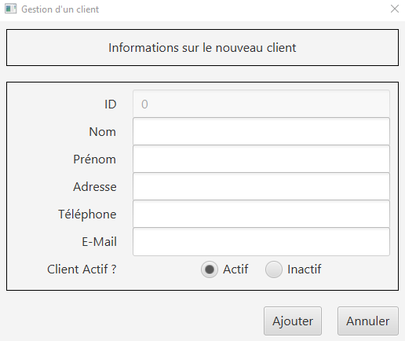
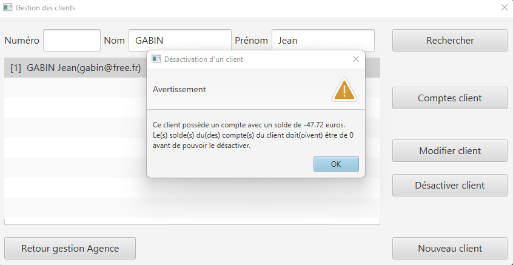
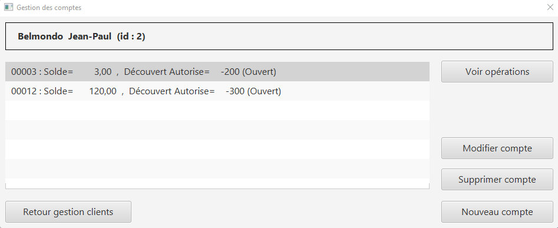
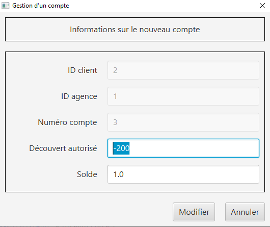
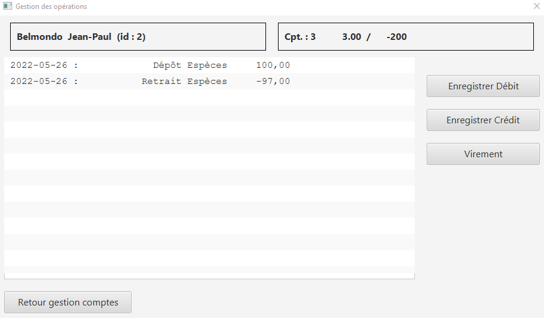
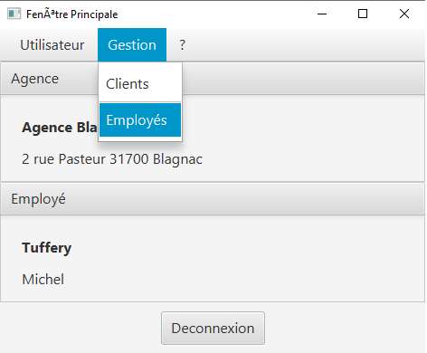
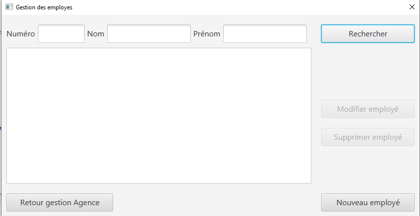
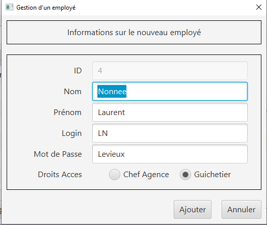
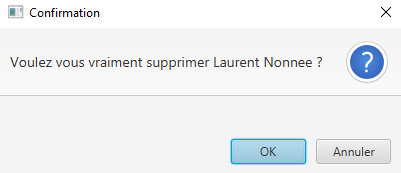

= Daily Bank App - Documentation utilisateur V1

Nom:: Documentation utilisateur V1

Date::
08/05/2022

Nom du client:: Daily Bank

Equipe::
Mazeau Antoine <antoine.mazeau31@gmail.com> +
Benachir Alexandre <alexandre.projetair@gmail.com> +
Recher Olivier <recher.olivier@outlook.fr> +
Martinet Leila <leila.mrtnt1@gmail.com> +

Sommaire::
<<I. Presentation>> +
<<II. Installation>> +
<<III. Fonctionnement>> +
<<IV. Résultats et jeux>> +

'''

== Bienvenue sur Daily Bank App

[id = "I. Presentation"]
=== I. Présentation de l'application

Cette application va vous permettre de gérer les comptes bancaires de vos clients. Nous allons vous accompagner afin que vous puissiez pleinement vous servir de cet outil, qui vous verrez, vous fera gagner du temps précieux, pour vous, et pour votre banque.

[id = "II. Installation"]
=== II. Installation

Prérequis::

* Possédé la version du jdk java 1.8_202
* avoir exécuteé le fichier setenv-cmd.bat pour paramétrer le jdk sur votre machine

Lancement de l'application::

* Le dossier d'installation sera fourni par votre banque 
* Dezippez le 

image::images/extraire.png[title="click Droit > 7-Zip > Extraire vers "Daily_Bank_V0\""] 

[%hardbreaks]

*Déplacez-vous dans le fichier créer

image::images/nouv_fichier.png[title="click Droit > Ouvrir"] 
[%hardbreaks]

* exécutez le fichier finissant par ".jar"

image::images/ouvrir_jar.png[title="click Droit > Ouvrir"]
[%hardbreaks]

[id = "III. Fonctionnement"]
=== III. Fonctionnement

L'application fonctionne pour les guichetiers de la banque ainsi que pour les chefs d'agence qui ont des fonctionnalité supplémentaire. Nous allons vous présenter comment l'application fonctionne.

* Connectez vous avec le login et le mot de passse fourni par votre banque

image::images/connexion.png[]

* Vous êtes désormais connecté et vous avez accès à vos informations ainsi qu'aux informations de votre banques

image::images/connexion_faite.png[]

* Dans le menu Utilisateur vous pouvez vous déconnecter de votre session

image::images/deconnexion.png[]

* Dans le menu Gestion, vous pouvez gérer les comptes des clients de la banque

image::images/menu_gestion_clients.png[]

image::images/gestion_clients.png[]

* Vous pouvez rechercher un client en particulier ou afficher tout les clients grâce au bouton "Rechercher"

image::images/rechercher.png[]

image::images/rechercher_client.png[]

* Une fois un client sélectionner, vous pouvez effectuer plusieurs actions sur ce client (client non cloturé)

image::images/client_selec.png[]

* Vous pouvez modifier ses informations. Les champs doivent être rempli correctement (pas trop de lettre, le mail contient '@' et '.', bon nombre de chiffre pour le numéro de téléphone)

image::images/client_modif.png[]

* Vous pouvez aussi créer un compte client. Les conditions sont les mêmes que précédemment.

* Vous pouvez désactiver un client seulement et seulement si tous les comptes du client en question sont cloturés.

* Dans Comptes client, vous pouvez efectuer plusieurs actions sur les comptes du client

* Vous pouvez modifier les informations d'un compte. Si vous modifiez le solde un débit ou crédit se fera automatiquement. Le solde doit être supérieur au débit autorisé.

* Vous pouvez notamment créer un compte bancaire. Le solde minimum à la création du compte est de 50 et le solde doit être supérieur au débit autorisé.

image::images/client_nouv_compte.png[]

* Vous pouvez aussi cloturer un compte du client, mais seulement si le solde du compte en question est à 0

image::images/compte-cloturer.png[]

* Dans "Voir Opérations", vous pouvez voir la liste des opérations qui ont été faites mais aussi effectuer un débit, un crédit ou encore un virement

* Si vous êtes un chef d'agence vous aurez accès a la possibilité de gérer les employés, c'est-à-dire, les autres chef d'agence et les guichetiers. Vous avez accès a la fenêtre de gestion dans employés dans le menu : Gestion => Employé

* Une fois dans la fenêtre de gestion, vous pouvez soit rechercher un employé en particulier ou rechercher tout les employés (faire une recherche sans critères) grâce au bouton en haut à droite "Rechercher". 

* Vous pouvez aussi directemment créer un nouveau employé grace au bouton "Nouveau employé"

image::images/nouveauEmployé.png[]

* Lorsque vous sélectionner un employé, vous pouvez modifier ses informations grâce au bouton "Modifier Employé"

* Vous pouvez aussi le supprimer grâce au bouton "Supprimer employé". Dans ce cas, un message de confirmation vous sera demander.

[id = "IV. Résultats et jeux"]
=== IV. Résultats et jeux d'essai
