= Daily Bank App - documentation utilisateur V0

Nom:: documentation utilisateur V0

Date::
08/05/2022

Nom du client:: Daily Bank

Equipe::
Mazeau Antoine <antoine.mazeau31@gmail.com> +
Benachir Alexandre <> +
Recher Olivier <recher.olivier@outlook.fr> +
Martinet Leila <leila.mrtnt1@gmail.com> +

Sommaire::
<<I. Presentation>> +
<<II. Installation>> +
<<III. Fonctionnement>> +
<<IV. Résultats et jeux>> +

'''

== Bienvenue sur Daily Bank App

[id = "I. Presentation"]
=== I. Présentation de l'application

Cette application va vous permettre de gérer les comptes bancaires de vos clients. Nous allons vous accompagner afin que vous puissiez pleinement vous servir de cet outil, qui vous verrez, vous fera gagner du temps précieux, pour vous, et pour votre banque.

[id = "II. Installation"]
=== II. Installation

Prérequis::

* Possédé la version du jdk java 1.8_202
* avoir exécuteé le fichier setenv-cmd.bat pour paramétrer le jdk sur votre machine

Lancement de l'application::

* Le dossier d'installation sera fourni par votre banque 
* Dezippez le 

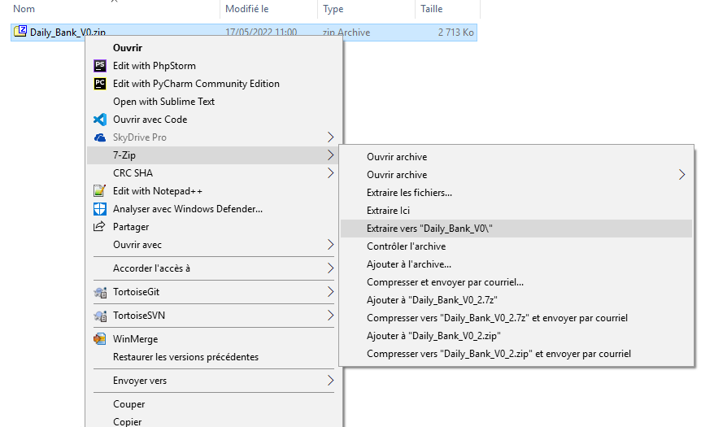 

[%hardbreaks]

*Déplacez-vous dans le fichier créer

 
[%hardbreaks]

* exécutez le fichier finissant par ".jar"

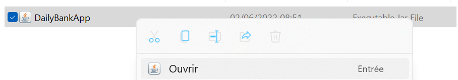
[%hardbreaks]

[id = "III. Fonctionnement"]
=== III. Fonctionnement

L'application fonctionne pour les guichetiers de la banque ainsi que pour les chefs d'agence qui ont des fonctionnalité supplémentaire. Nous allons vous présenter comment l'application fonctionne.

* Connectez vous avec le login et le mot de passse fourni par votre banque

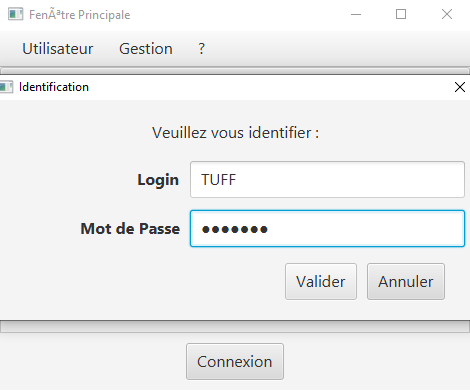

* Vous êtes désormais connecté et vous avez accès à vos informations ainsi qu'aux informations de votre banques

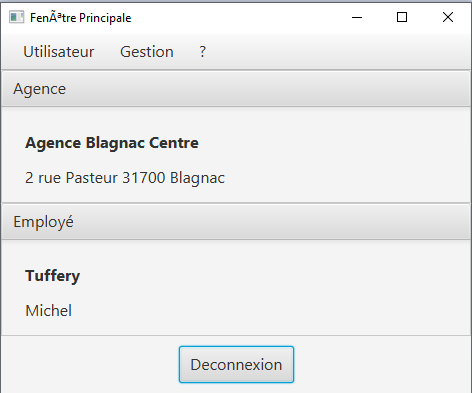

* Dans le menu Utilisateur vous pouvez vous déconnecter de votre session

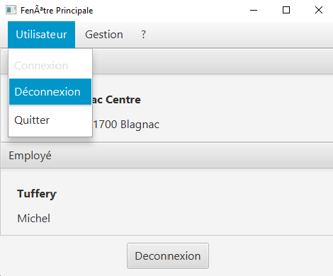

* Dans le menu Gestion, vous pouvez gérer les comptes des clients de la banque

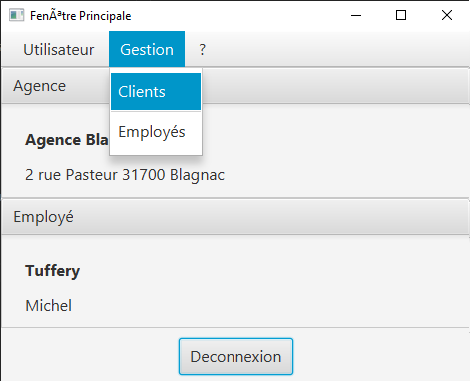

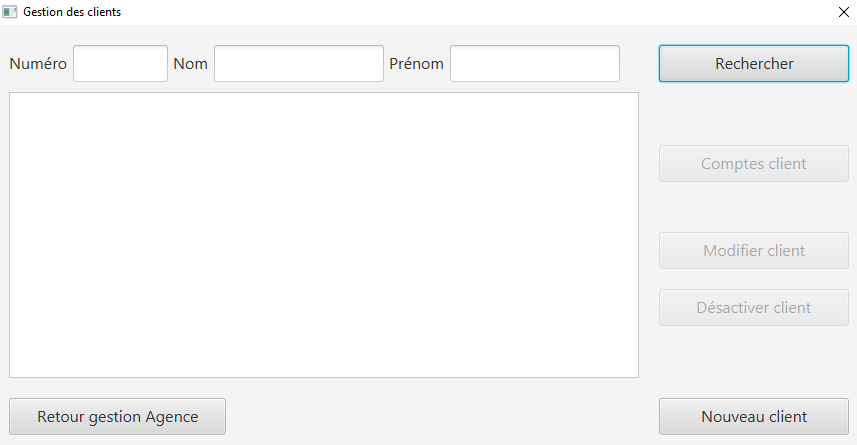

* Vous pouvez rechercher un client en particulier ou afficher tout les clients grâce au bouton "Rechercher"

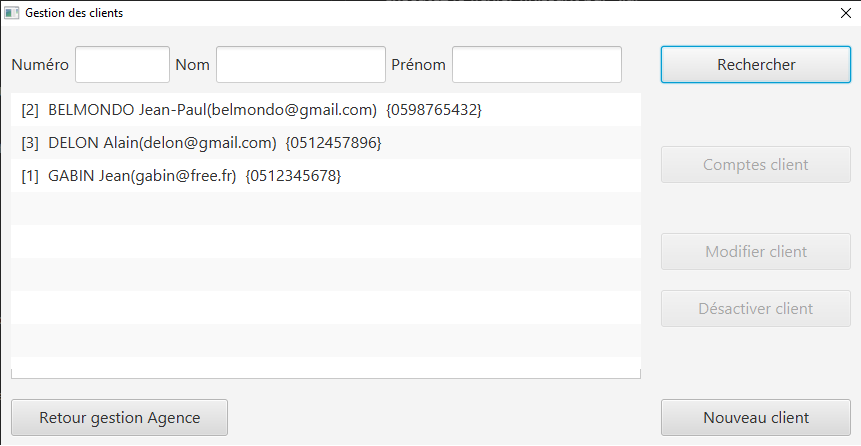

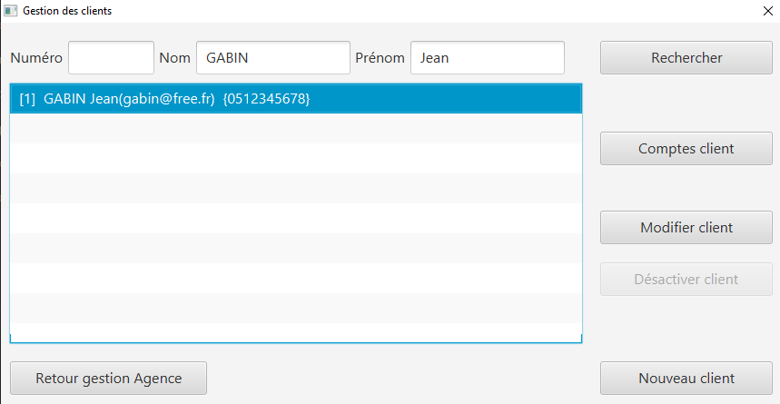

* Une fois un client sélectionner, vous pouvez accèder aux information du client ou bien modifier le client

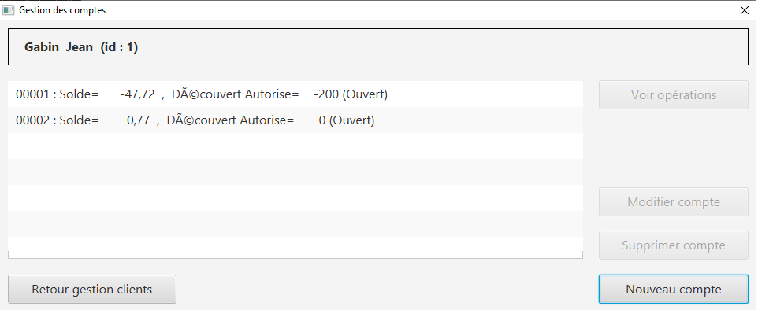

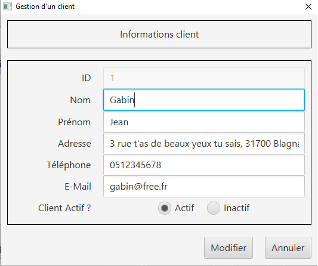

* Dans Comptes client, en plus des informations du client, vous avez la possibilté de rajouter un compte au client en question

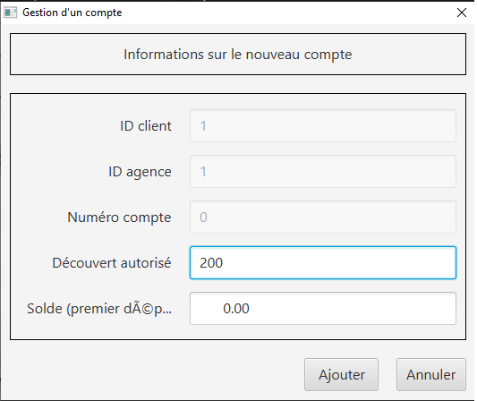

* Vous pouvez aussi cloturer un compte du client, mais seulement si le solde du compte en queston est à 0

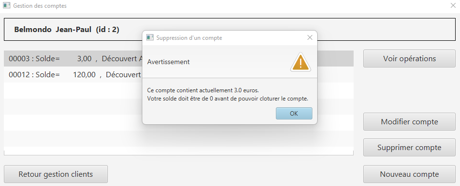

[id = "IV. Résultats et jeux"]
=== IV. Résultats et jeux d'essai
