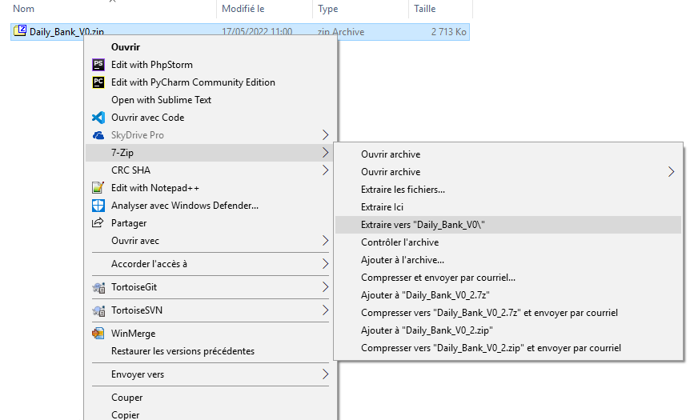

= Daily Bank App - documentation utilisateur V0

Nom:: documentation utilisateur V0

Date::
08/05/2022

Nom du client:: Daily Bank

Equipe::
Mazeau Antoine <antoine.mazeau31@gmail.com> +
Benachir Alexandre <> +
Recher Olivier <recher.olivier@outlook.fr> +
Martinet Leila <leila.mrtnt1@gmail.com> +

Sommaire::
<<I. Presentation>> +
<<II. Installation>> +
<<III. Fonctionnement>> +
<<IV. Résultats et jeux>> +

'''

== Bienvenue sur Daily Bank App

[id = "I. Presentation"]
=== I. Présentation de l'application

Cette application va vous permettre de gérer les comptes bancaires de vos clients. Nous allons vous accompagner afin que vous puissiez pleinement vous servir de cet outil, qui vous verrez, vous ferra gagner du temps précieux, pour vous, et pour votre banque.

[id = "II. Installation"]
=== II. Installation

Prérequis::

* Possédé la version du jdk java 1.8_202
* avoir exécuter le fichier setenv-cmd.bat 

En tout premier lieu, occupons-nous de l'installation, Vous allez voir cela n'est pas compliqué et nous allons vous guidé pas à pas.

* Le dossier d'installation sera fournit par votre banque 
* Dezipper le (click Droit > 7-zip > )

* exécuter le fichier finissant par ".jar"

[id = "III. Fonctionnement"]
=== III. Fonctionnement

[id = "IV. Résultats et jeux"]
=== IV. Résultats et jeux d'essai
